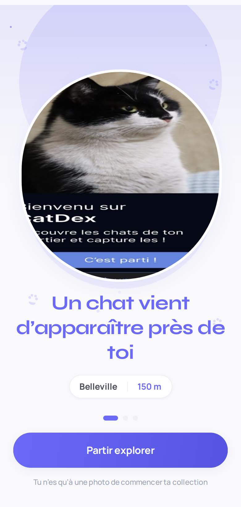

# CatDex

**Ton quartier. Tes chats.**

Application mobile (iOS, Android & web) pour capturer de vrais chats dans la rue,
les analyser à l’IA, les placer sur une carte et construire un CatDex.

> **Repo public** — le code UI est ici. Les **secrets API** (OpenAI, service_role,
> JWT) restent **de ton côté**. Lis [SECURITY.md](./SECURITY.md) et
> l’[agenda de nettoyage](./docs/PUBLIC_REPO_AGENDA.md).

## Fonctionnalités

Onboarding game-feel (apparition → IA → premier chat) · Carte · Scanner · Analyse IA (via API privée) · CatDex · Missions · Profil

Détail : **[docs/FEATURES.md](./docs/FEATURES.md)** · galerie : [`screenshots/index.html`](./screenshots/index.html)




## Stack

- **App** : Expo 54 · React Native · TypeScript · Expo Router
- **Backend data** : Supabase (Auth, Database, Storage) — projet & clés chez toi
- **API analyse** : Hono + OpenAI Vision — déployée avec secrets hors Git
- Design system : `src/theme/` via `useTheme()`

## Démarrer (local)

```bash
npm install
cp .env.example .env
# Renseigne EXPO_PUBLIC_SUPABASE_* et EXPO_PUBLIC_API_URL en local uniquement
npm start
```

### Supabase (données / auth)

Guide placeholders : **[SUPABASE_SETUP.md](./SUPABASE_SETUP.md)**  
Schéma : `supabase/schema.sql`

### API d’analyse (privée)

```bash
cp server/.env.example server/.env
# OPENAI_API_KEY + secrets Supabase serveur → machine locale ou Render, jamais Git
npm run server
```

Sans clé OpenAI, l’API peut renvoyer une analyse mock selon la config.

### Simulateur iOS (Mac)

```bash
npm run ios:sim
```

## Structure

```
catdex/
├── app/                 # Routes Expo Router
├── src/                 # UI, store, theme, lib client
├── supabase/            # Schéma & migrations (pas de secrets)
├── server/              # API Hono (code public, clés privées)
├── docs/
│   ├── FEATURES.md
│   ├── PUBLIC_REPO_AGENDA.md
│   └── releases/
├── SECURITY.md
└── CHANGELOG.md
```

Architecture : [`docs/ARCHITECTURE.md`](./docs/ARCHITECTURE.md)

## Commandes

```bash
npm start          # Expo
npm run ios:sim    # Simulateur iOS
npm run web        # Web
npm run server     # API locale
npm run lint
npm run typecheck
```

## Variables d’environnement

**App** (`.env`, gitignoré) — voir `.env.example` :

```env
EXPO_PUBLIC_SUPABASE_URL=https://YOUR_PROJECT_REF.supabase.co
EXPO_PUBLIC_SUPABASE_ANON_KEY=your-anon-key-here
EXPO_PUBLIC_API_URL=https://your-api.example.com
```

**Serveur** (`server/.env`, gitignoré) — voir `server/.env.example` :

- `OPENAI_API_KEY`
- `SUPABASE_URL`
- `SUPABASE_JWT_SECRET`
- `SUPABASE_SERVICE_ROLE_KEY`

Ces quatre-là ne sont **jamais** préfixées `EXPO_PUBLIC_` et ne sont **jamais**
commitées. Détail : [SECURITY.md](./SECURITY.md) · [KEYS_TO_GET.md](./KEYS_TO_GET.md)

## Docs utiles

| Doc | Rôle |
|-----|------|
| [docs/PUBLIC_REPO_AGENDA.md](./docs/PUBLIC_REPO_AGENDA.md) | Plan cleanup public / privé |
| [docs/FEATURES.md](./docs/FEATURES.md) | Carte des fonctionnalités |
| [SECURITY.md](./SECURITY.md) | Politique secrets |
| [CHANGELOG.md](./CHANGELOG.md) | Releases |
| [docs/releases/WEB_BETA.md](./docs/releases/WEB_BETA.md) | Bêta web |
| [docs/releases/STORE_CHECKLIST.md](./docs/releases/STORE_CHECKLIST.md) | Stores |

Guides ops historiques (Render, téléphone, etc.) restent dans le repo pour
référence ; les **valeurs réelles** vont uniquement dans tes dashboards.

## Licence

Voir [LICENSE](./LICENSE)
