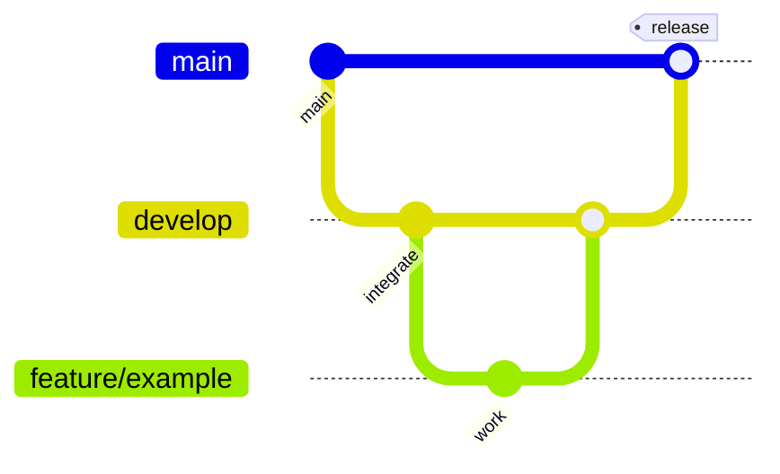

# CatDex Git Workflow

Permanent branches only:

| Branch | Role |
|--------|------|
| `main` | Production — always stable, deployable |
| `develop` | Integration — all features land here first |

Everything else is temporary (`feature/*`, `fix/*`, `hotfix/*`, `chore/*`, `docs/*`) and deleted after merge.

## Flow (Mac + Cursor Cloud)

```text
develop
  └─ feature/… | fix/… | hotfix/… | chore/… | docs/…
        └─ Pull Request → develop
              └─ Pull Request / release → main
                    └─ Production (EAS / API)
```



## Branch naming

```text
feature/scanner-ritual
feature/discovery-climax
feature/catdex-album
feature/profile-v2
feature/map-redesign
feature/gps-recenter
fix/login
fix/navigation
fix/supabase
hotfix/crash-ios
hotfix/api
chore/design-system
chore/dependencies
docs/product-book
docs/architecture
```

Do **not** create long-lived `cursor/*`, `staging`, or `map` branches. Cursor Cloud agents should open PRs into `develop` (or `main` only for hotfixes).

## Daily commands

### Start work (Mac or Cloud)

```bash
git fetch origin
git checkout develop
git pull --ff-only origin develop
git checkout -b feature/my-change
```

### Ship a feature

```bash
git push -u origin HEAD
gh pr create --base develop --title "feat: …" --body "…"
# after review + merge:
git checkout develop && git pull --ff-only
git branch -d feature/my-change
git push origin --delete feature/my-change   # if still on remote
git fetch --prune
```

### Release to production

```bash
git checkout main
git pull --ff-only origin main
git merge --ff-only origin/develop   # or open PR develop → main
git push origin main
```

## Mac ↔ Cursor Cloud

| Concern | Rule |
|---------|------|
| Same remote | Always `origin` = `https://github.com/imfire3/CatDex.git` |
| Sync before work | `git fetch --prune` then `git pull --ff-only` |
| WIP | Prefer a `feature/*` commit + push over long-lived stash |
| Never | `git push --force` on `main` / `develop` |
| Never | `git reset --hard` / `git branch -D` without explicit approval |
| Cloud path | Typically `/workspace` — same git commands as macOS |

## Safety checklist before deleting a branch

1. `git rev-list --count origin/main..<branch>` is `0` (no unique commits), **or** the unique work was intentionally abandoned after review.
2. Tip is an ancestor of `main` / `develop` (`git merge-base --is-ancestor`).
3. Linked PR is merged or explicitly closed.
4. Branch is not checked out in an active Cloud agent.

## Stashes

Stashes are short-term only. For anything that must survive days: create `feature/…` or `wip/…`, commit, push.
